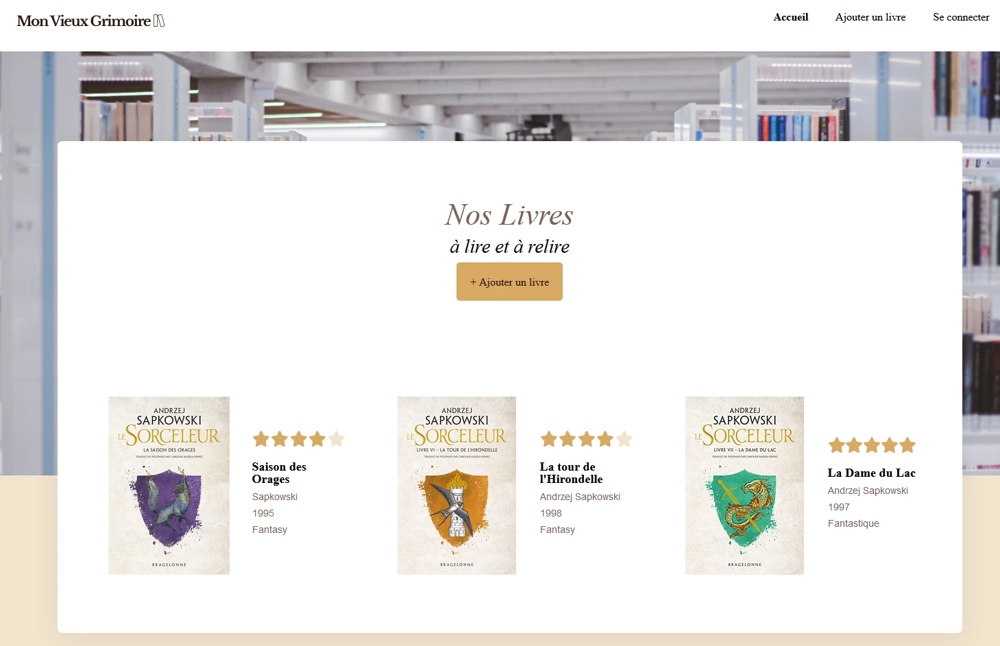

# Mon vieux Grimoire

## Projet n°7 de la formation Développeur Web OpenClassrooms

## Contexte

Je suis développeur back-end en freelance depuis maintenant un an dans la région de Lille. J'ai l’habitude de travailler avec Kévin, un développeur front-end plus expérimenté que moi, et qui a déjà un bon réseau de contacts dans le milieu.

Kévin me contacte pour me proposer de travailler avec lui en mutualisant nos compétences front / back sur un tout nouveau projet qui lui a été proposé. Il s’agit d’une petite chaîne de librairies qui souhaite ouvrir un site de référencement et de notation de livres.

## Objectif

Développer le back-end du site de référencement et de notation de livres.

## Technos

  

Utilisation de `Figma` pour la maquette. 
Utilisation de `React` pour le développement et de `Saas` pour le style. 
Utilisation de `GitHub` pour le versionning. 

## Spécifications de l'API

### Routes et Autorisations

- Toutes les routes pour les livres doivent disposer d’une autorisation (le token est envoyé par le front-end avec l'en-tête d’autorisation « Bearer »).
- Avant qu’un utilisateur puisse apporter des modifications à la route livre (`book`), le code doit vérifier si le `userId` actuel correspond au `userId` du livre.
- Si le `userId` ne correspond pas, renvoyer « 403: unauthorized request ». Cela permet de s'assurer que seul le propriétaire d’un livre puisse apporter des modifications à celui-ci.

### Gestion des Erreurs

- Les erreurs éventuelles doivent être renvoyées telles qu'elles se sont produites, sans modification ni ajout.
- Si nécessaire, utilisez une nouvelle `Error()`.

## Modèles de Données

### Utilisateur (User)

- `email` : Adresse e-mail de l’utilisateur (unique)
- `password` : Mot de passe haché de l’utilisateur

### Livre (Book)

- `userId` : Identifiant MongoDB unique de l'utilisateur qui a créé le livre
- `title` : Titre du livre
- `author` : Auteur du livre
- `imageUrl` : Illustration/couverture du livre
- `year` : Année de publication du livre
- `genre` : Genre du livre
- `ratings` : Tableau des notes données au livre, chaque note comprenant :
  - `userId` : Identifiant MongoDB unique de l'utilisateur qui a noté le livre
  - `grade` : Note donnée au livre
- `averageRating` : Note moyenne du livre

## Sécurité

- Le mot de passe de l'utilisateur doit être haché.
- L'authentification doit être renforcée sur toutes les routes livre (`book`) requises.
- Les adresses électroniques dans la base de données doivent être uniques, un plugin Mongoose approprié doit être utilisé pour garantir leur unicité et signaler les erreurs.
- La sécurité de la base de données MongoDB (à partir d'un service tel que MongoDB Atlas) ne doit pas empêcher l'application de se lancer sur la machine d'un utilisateur.
- Les erreurs issues de la base de données doivent être remontées.
